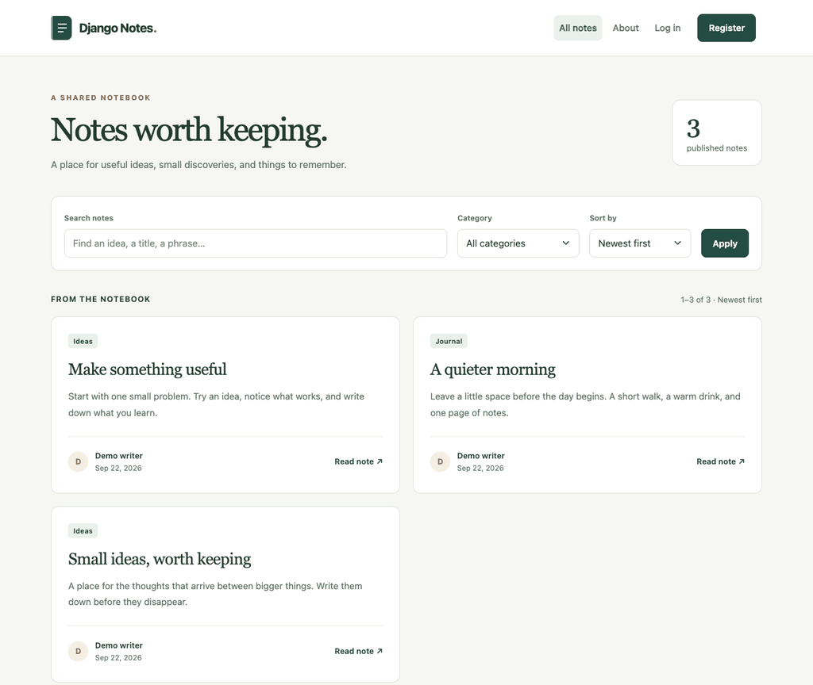

# Django Notes App

[](https://www.python.org/)
[](https://www.djangoproject.com/)
[](LICENSE.md)

A place for ideas you want to come back to. Write a quick note, keep it as a draft, or publish it for others to read. Search and categories help you find it again.

**New notes are public by default.** Choose **Draft** before saving to keep a note visible only to you and site administrators. Other users cannot edit or delete your notes.

Built with Django, TinyMCE, Bootstrap, and SQLite, with layouts for desktop and mobile.

## Demo

A quick look at writing a note, saving it as a private draft, and publishing it when it's ready. The recording uses sample notes and a demo account.



[Open the demo GIF](demo.gif) if the preview doesn't load.

## Run it locally

You'll need Python 3.12 or newer and pip. Copy this repository's clone URL from the **Code** menu, then replace `<repository-url>` below with it:

```bash
git clone <repository-url>
cd Django-Notes-App
python3 -m venv .venv
source .venv/bin/activate
python -m pip install -r requirements.txt
python my_site/manage.py migrate
python my_site/manage.py runserver
```

Open http://127.0.0.1:8000 and you're ready to go. On Windows PowerShell, replace the activation command with `.venv\Scripts\Activate.ps1`.

Already have a checkout? After pulling the latest code, activate your virtual environment, install the requirements again, and run `migrate`. Migration `0012` adds drafts while keeping existing notes published. If that environment still uses Python 3.11, recreate it with Python 3.12 or newer first.

## Write your first note

1. Choose **Register** to create an account. You'll be signed in automatically.
2. Select **Create a new post** and add a title and some text. Categories are optional.
3. Choose **Draft** to keep working privately, or **Published** to let anyone read it.
4. Hit **Save**. You can return to the note through **My notes**.

To publish a draft, open it, choose **Edit note**, change its visibility to **Published**, and save. You can also switch a published note back to Draft. **Delete note** asks for confirmation before removing it.

### Find and reuse your notes

Search by title or text, filter by category, and sort by newest, oldest, or title. **My notes** brings your writing together, with tabs for drafts and published notes. Filters stay in place as you move between pages.

Open a note to **Copy text**, **Download .txt**, or **Print** it. Copy needs browser clipboard permission; downloading works without JavaScript. Draft pages and downloads are available only to their owner through the app.

### A few things to know about the editor

Reading pages show plain text with paragraph and line breaks. Bold text and embedded images from the editor won't appear there.

The editor shows a word count and warns before you leave with unsaved changes. Press **Ctrl+Enter** (or **⌘+Enter** on macOS) to save. These helpers need JavaScript; the forms also work without it. Unsaved text stays in the current page and is not backed up automatically.

### Add categories

Categories are managed in Django admin. Create an administrator account from the repository root:

```bash
python my_site/manage.py createsuperuser
```

Then sign in at http://127.0.0.1:8000/admin/ to add them. You can write notes without setting up any categories.

## Prefer Docker?

With Docker and its Compose plugin installed, run:

```bash
docker compose up --build
```

The app will be at http://127.0.0.1:8000. Migrations run on startup, and your SQLite database is kept in the `notes-data` volume at `/data/db.sqlite3`.

To create an admin account while the container is running:

```bash
docker compose exec web python manage.py createsuperuser
```

Use `docker compose down` to stop it; your database stays in the volume. After changing the code, run `docker compose up --build` again. This setup uses Django's development server and is intended for local use.

Compose checks the app's health automatically. Run `docker compose ps` to see
whether the service is healthy. The `/health/` endpoint returns HTTP 200 with
`{"status": "ok"}` when the notes table can be read, or HTTP 503 when the database
or table is unavailable. It returns no note or account data and is not cached.
This is a database readiness check, not a complete check of external services or
pending migrations. A failed check marks the container unhealthy; it does not
restart it automatically.

## Settings

The app reads these environment variables directly. [.env.example](.env.example) lists them with setup notes; it doesn't load a `.env` file automatically. For Docker, set them in the Compose service's `environment` section.

| Variable | Default | What it controls |
| --- | --- | --- |
| `DJANGO_DEBUG` | `true` | Development mode |
| `DJANGO_SECRET_KEY` | Development-only key | Required when debug is disabled |
| `DJANGO_ALLOWED_HOSTS` | `localhost,127.0.0.1` | Comma-separated hostnames |
| `DJANGO_DATABASE_PATH` | `my_site/db.sqlite3` | SQLite database location |

For a production deployment, set `DJANGO_DEBUG=false`, supply a private secret key and your allowed hosts, and configure HTTPS. Use a production WSGI/ASGI server and serve the static files collected by `python my_site/manage.py collectstatic`. Turning debug off also enables secure cookies and HTTPS redirects.

With your production environment variables set, check the configuration with:

```bash
python my_site/manage.py check --deploy
```

### Login and signup limits

Login attempts are limited to 20 per IP address and 10 per username every 10 minutes. This includes successful logins and Django admin logins. Signup allows 5 attempts per IP address per hour. Once a limit is reached, the app returns HTTP 429 with a `Retry-After` header.

The counters are stored in the database so they work across app processes. You can change the limits in `AUTH_ATTEMPT_LIMITS` in the Django settings. GET requests and requests rejected by CSRF protection don't count.

If you're running behind a reverse proxy, configure the trusted server layer to pass along the real client address. The app uses `REMOTE_ADDR` rather than trusting forwarding headers from the client.

## Working on the code

Use `requirements.txt` to run the app, or `requirements-dev.txt` to work on it.
The development file includes the application requirements, so you only need
one install command. Playwright's browser is a separate, optional download.

| File | Installs |
| --- | --- |
| `requirements.txt` | Django and the editor integration |
| `requirements-dev.txt` | Application dependencies, `pip-audit`, and Playwright |

With your virtual environment active, run these from the repository root:

```bash
python scripts/check.py
```

This runs Django's system checks, checks for missing migrations, and runs the
application tests. It stops at the first failure and uses your active Python
environment. CI uses the same command.

The tests cover signing in, ownership permissions, editing and deletion, search, pagination, text rendering, migrations, CSRF, and authentication limits.

To check Python dependencies for known vulnerabilities:

```bash
python -m pip install -r requirements-dev.txt
python scripts/check.py --audit
```

The optional audit covers application, development, and browser-test dependencies
and needs network access. You can still run individual Django
commands through `python my_site/manage.py` when working on a specific test.

CI runs these checks on pushes and pull requests to `main`, along with Docker tests and static file collection. The dependency audit covers Python packages, not bundled JavaScript. Dependabot checks the application and development requirements for updates.

The editor uses a local copy of TinyMCE 7.9.3 because the Django package bundles an older version. Its [source and update notes](my_site/static/vendor/tinymce-7.9.3/UPSTREAM.md) explain how to keep it patched.

The writing workflow also has a browser test, using a temporary test database:

```bash
python -m pip install -r requirements-dev.txt
python -m playwright install chromium
python scripts/test_browser.py
```

CI runs it in Chromium. It covers draft privacy, publishing, unsaved-change warnings,
keyboard saving, downloads, clipboard feedback, print layout, and mobile sizing.

Most of the app code lives in `my_site/blog_app/`. Page templates are in `my_site/templates/`, styles and other assets are in `my_site/static/`, and Django settings are in `my_site/my_site/`.

For more detail, see the [contributing guide](.github/CONTRIBUTING.md) and [changelog](CHANGELOG.md). To report a security issue, follow the [security policy](SECURITY.md).

## License

[Apache 2.0](LICENSE.md).
