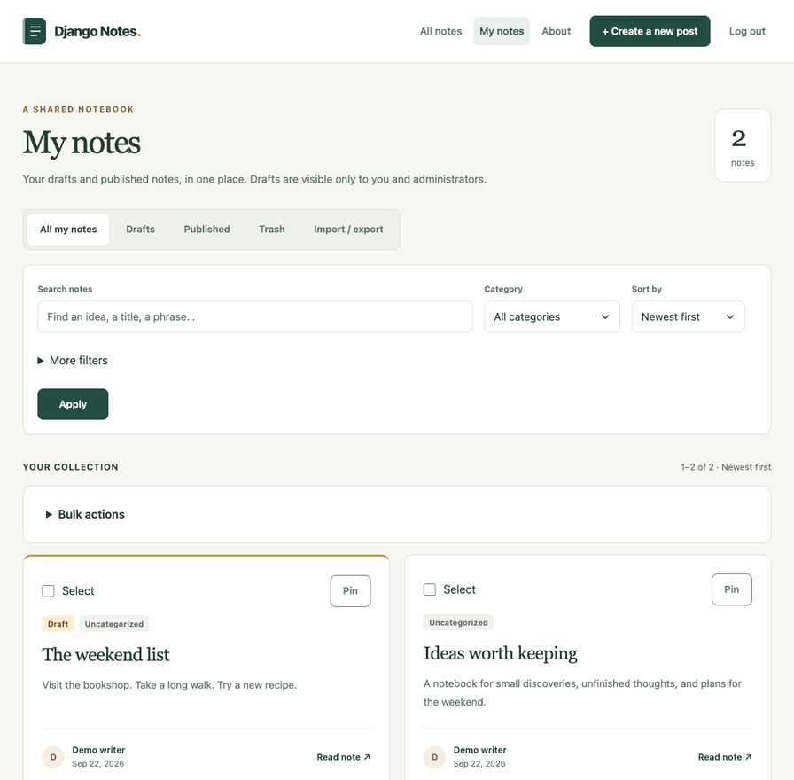

# Django Notes App

[](https://www.python.org/)
[](https://www.djangoproject.com/)
[](LICENSE.md)

A place for ideas you want to come back to. Write a quick note, keep it as a draft, or publish it for others to read. Search and categories help you find it again.

**New notes are public by default.** Choose **Draft** before saving to keep a note visible only to you and site administrators. Other users cannot edit or delete your notes.

Built with Django, TinyMCE, Bootstrap, and SQLite, with layouts for desktop and mobile.

## Demo

A quick look at writing a private draft, keeping a recovery copy, pinning it, restoring an earlier version, and bringing it back from Trash. The recording uses sample notes in a temporary database.



[Open the demo GIF](docs/demo.gif) if the preview doesn't load.

## Run it locally

You'll need Python 3.12 or newer and pip. Copy this repository's clone URL from the **Code** menu, then replace `<repository-url>` below with it:

```bash
git clone <repository-url>
cd Django-Notes-App
python3 -m venv .venv
source .venv/bin/activate
python -m pip install -r requirements.txt
python src/manage.py migrate
python src/manage.py runserver
```

Open http://127.0.0.1:8000 and you're ready to go. On Windows PowerShell, replace the activation command with `.venv\Scripts\Activate.ps1`.

Already have a checkout? After pulling the latest code, activate your virtual environment, install the requirements again, and run `migrate`. The latest migrations add recovery copies, Trash, version history, pins, and personal tags without changing existing notes or their visibility. Back up your database before upgrading. If that environment still uses Python 3.11, recreate it with Python 3.12 or newer first.

The source directory is now `src/`. If your existing database is still at
`my_site/db.sqlite3`, move it to `src/db.sqlite3` before running migrations,
or set `DJANGO_DATABASE_PATH` to its absolute path. Custom server configurations
should use `config.wsgi:application` or `config.asgi:application` with `src/`
on the Python path. The existing database tables and migration records retain
their `blog_app` identity.

## Write your first note

1. Choose **Register** to create an account. You'll be signed in automatically.
2. Select **Create a new post** and add a title and some text. Categories are optional.
3. Choose **Draft** to keep working privately, or **Published** to let anyone read it.
4. Hit **Save**. You can return to the note through **My notes**.

To publish a draft, open it, choose **Edit note**, change its visibility to **Published**, and save. You can also switch a published note back to Draft. **Delete note** asks for confirmation before moving it to **Trash**. Restore it there as a private draft, or explicitly confirm permanent deletion.

### Find and reuse your notes

Search by title or text, with matching words highlighted in the results. **More filters** adds creation-date limits and, in **My notes**, a personal-tag filter. Filters stay in place as you move between pages.

Keep frequent notes at the top of **My notes** with **Pin**. This doesn't affect the public feed. Add personal tags in the editor, separated by commas; each note can have up to 12 tags of 32 characters. Tags are visible only to you in the app.

Select notes to add tags, make them drafts, publish them, or move them to Trash together. Publishing and moving to Trash show a confirmation page first. With JavaScript, you can select every note on the current page at once.

Open a note to **Copy text**, **Download .txt**, **Download Markdown**, or **Print** it. Copy needs browser clipboard permission; downloading works without JavaScript. Draft pages and downloads are available only to their owner through the app.

### A few things to know about the editor

Reading pages preserve headings, lists, emphasis, quotations, code blocks, and links. HTML is cleaned before display; scripts, inline styles, and embedded images are removed.

The editor saves a private recovery copy after you pause typing. Returning to the same editor restores that copy; unfinished new notes are recovered through **Create a new post**. Recovery never changes a published note or publishes your work. Use **Save** to apply changes and the selected visibility. Watch the save status: a failed backup leaves your changes in the current tab. Keep each note below 200 KB.

There's one recovery copy per existing note, plus one for an unfinished new note, per account. If another tab saves first, reload before continuing; copy any text you want to keep first. The editor still warns before leaving unapplied changes.

Use **Version history** on a note to preview and restore one of its last 50 saved versions. Restoring creates a private draft and keeps the current text in history, so you can return to it.

The editor also shows a word count. Press **Ctrl+Enter** (or **⌘+Enter** on macOS) to save. Automatic recovery, word counts, and keyboard shortcuts need JavaScript; ordinary forms and downloads work without it.

### Import and back up

Open **Import / export** from **My notes** to download a ZIP of your current notes as Markdown, including drafts and Trash. A manifest records titles, tags, categories, visibility, and pinned status. Version history and recovery copies aren't part of this export; back up the database to retain those too.

Import a UTF-8 `.md` file or a ZIP of Markdown notes. Imports create new private drafts and never overwrite existing notes, even for notes that were previously published or in Trash. App backups restore personal tags, pins, and categories that still exist. Importing twice creates duplicates.

Each transfer supports up to 1,000 notes, 200 KB per note, and 25 MB of uncompressed text. Embedded HTML in imported Markdown is treated as text.

### Add categories

Categories are managed in Django admin. Create an administrator account from the repository root:

```bash
python src/manage.py createsuperuser
```

Then sign in at http://127.0.0.1:8000/admin/ to add them. You can write notes without setting up any categories.

## Prefer Docker?

Start Docker Desktop (or your Docker daemon), then run:

```bash
docker compose up --build --detach --wait
```

The app will be at http://127.0.0.1:8000 once its health check passes. Migrations run on startup, and your SQLite database is kept in the `notes-data` volume at `/data/db.sqlite3`. Follow startup and request logs with `docker compose logs --follow web`.

The container runs as an unprivileged user (UID/GID `10001`). If you have a volume
created by an older image that ran as root, stop the service and update that
volume's ownership once before starting the new image:

```bash
docker compose stop web
docker compose run --rm --no-deps --user root --cap-add CHOWN web chown -R 10001:10001 /data
docker compose up --build --detach --wait
```

To create an admin account while the container is running:

```bash
docker compose exec web python manage.py createsuperuser
```

Use `docker compose down` to stop it; your database stays in the volume. After changing the code, run `docker compose up --build --detach --wait` again. This setup uses Django's development server with the reloader disabled and is intended for local use.

You can also run the image without Compose:

```bash
docker build -t django-notes:local .
docker run --detach --name django-notes --init --publish 127.0.0.1:8000:8000 --volume notes-data:/data django-notes:local
```

Choose either Compose or the standalone command for port 8000. The image has
the same automatic migrations and health check in both cases. Standalone Docker
and Compose use separately named volumes by default.

Compose checks the app's health automatically. Run `docker compose ps` to see
whether the service is healthy. The `/health/` endpoint returns HTTP 200 with
`{"status": "ok"}` when the notes table can be read, or HTTP 503 when the database
or table is unavailable. It returns no note or account data and is not cached.
This is a database readiness check, not a complete check of external services or
pending migrations. A failed check marks the container unhealthy; it does not
restart it automatically.

## Settings

The app reads these environment variables directly. [.env.example](.env.example) lists them with setup notes; it doesn't load a `.env` file automatically. For Docker, set them in the Compose service's `environment` section.

| Variable | Default | What it controls |
| --- | --- | --- |
| `DJANGO_DEBUG` | `true` | Development mode |
| `DJANGO_SECRET_KEY` | Development-only key | Required when debug is disabled |
| `DJANGO_ALLOWED_HOSTS` | `localhost,127.0.0.1` | Comma-separated hostnames |
| `DJANGO_DATABASE_PATH` | `src/db.sqlite3` | SQLite database location |
| `DJANGO_TRUST_PROXY_HEADERS` | `false` | Trust protocol/client-IP headers only behind the isolated production proxy |

For a production deployment, use the separate [production guide](docs/deployment.md).
It covers the Gunicorn and Caddy stack, HTTPS, database backups, and upgrades.
Turning debug off enables secure cookies and HTTPS redirects.

With your production environment variables set, check the configuration with:

```bash
python src/manage.py check --deploy
```

### Login and signup limits

Login attempts are limited to 20 per IP address and 10 per username every 10 minutes. This includes successful logins and Django admin logins. Signup allows 5 attempts per IP address per hour. Once a limit is reached, the app returns HTTP 429 with a `Retry-After` header.

The counters are stored in the database so they work across app processes. You can change the limits in `AUTH_ATTEMPT_LIMITS` in the Django settings. GET requests and requests rejected by CSRF protection don't count.

If you're running behind a reverse proxy, configure the trusted server layer to pass along the real client address. The app uses `REMOTE_ADDR` rather than trusting forwarding headers from the client.

## Working on the code

Use `requirements.txt` to run the app, or `requirements-dev.txt` to work on it.
The development file includes the application requirements, so you only need
one install command. Playwright's browser is a separate, optional download.

| File | Installs |
| --- | --- |
| `requirements.txt` | Django, the editor integration, HTML cleaning, and Markdown conversion |
| `requirements-dev.txt` | Application dependencies, `pip-audit`, and Playwright |

With your virtual environment active, run these from the repository root:

```bash
python scripts/check.py
```

This runs Django's system checks, checks for missing migrations, and runs the
application tests. It stops at the first failure and uses your active Python
environment. CI uses the same command.

The tests cover signing in, ownership permissions, editing and deletion, search, pagination, text rendering, migrations, CSRF, and authentication limits.

To check Python dependencies for known vulnerabilities:

```bash
python -m pip install -r requirements-dev.txt
python scripts/check.py --audit
```

The optional audit covers application, development, and browser-test dependencies
and needs network access. You can still run individual Django
commands through `python src/manage.py` when working on a specific test.

CI runs these checks on pushes and pull requests to `main`, along with Docker tests and static file collection. The dependency audit covers Python packages, not bundled JavaScript. Dependabot checks the application and development requirements for updates.

The editor uses a local copy of TinyMCE 7.9.3 because the Django package bundles an older version. Its [source and update notes](src/static/vendor/tinymce-7.9.3/UPSTREAM.md) explain how to keep it patched.

The writing workflow also has a browser test, using a temporary test database:

```bash
python -m pip install -r requirements-dev.txt
python -m playwright install chromium
python scripts/test_browser.py
```

CI runs it in Chromium. It covers draft privacy, publishing, unsaved-change warnings,
keyboard saving, recovery, history, Trash, tags, bulk actions, backup import/export, downloads, clipboard feedback, print layout, and mobile sizing. Keyboard focus, field labels, and selection announcements are checked too.

To regenerate the demo with synthetic data, run `python scripts/record_demo.py`.
It uses the same browser dependencies and writes `docs/demo.gif` without changing
your notes. Set `PLAYWRIGHT_CHANNEL=chrome` to use an installed Chrome browser.

With Docker running, `python scripts/test_production.py` checks the production
stack over local HTTPS using a verified test certificate. It creates an isolated
Compose project on loopback ports 18080/18443 and removes its test volumes afterward.
CI runs this check too; it does not contact a public certificate authority.

The project is organized as follows:

```text
src/
├── manage.py
├── config/            # Django settings and entry points
├── notes/             # Application code and migrations
│   └── tests/         # Application regression tests
├── templates/         # notes, accounts, forms, partials, and errors
└── static/            # CSS, JavaScript, and vendor assets
scripts/               # Local and CI checks, browser tests
docs/demo.gif          # README demo
Dockerfile             # Container image definition
```

For more detail, see the [contributing guide](.github/CONTRIBUTING.md) and [changelog](CHANGELOG.md). To report a security issue, follow the [security policy](SECURITY.md).

## License

[Apache 2.0](LICENSE.md).
